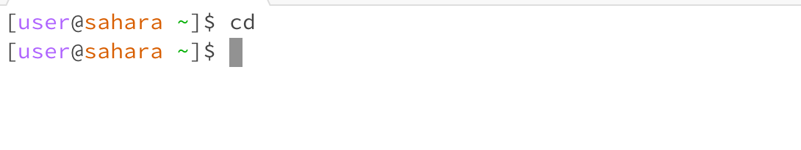

Code:
cd
**Q1** The working directory was /home.
**Q2** There was no path towards any directory, so the end result was a default to /home.
**Q3** there was no error.

Code: 
cd lecture1
cd
**Q1** The working directory was /home/lecture1.
**Q2** The working directory changed from lecture 1 back to home after running cd in the directory.
**Q3** There was no error.

**Q1** The working directory was 

