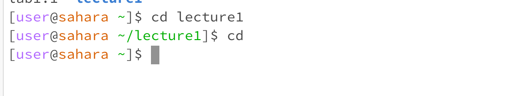

Code:  
cd  
**Q1** The working directory was /home.  
**Q2** There was no path towards any directory, so the end result was a default to /home. It equates to returning back to its origin location.  
**Q3** there was no error.  

Code:  
cd lecture1  
**Q1** The working directory was /home/lecture1.  
**Q2** The working directory changed to lecture 1.  
**Q3** There was no error.  
  

Code:  
cd lecture1  
cd messages  
cd af.txt  
**Q1** The working directory was /home/lecture1/messages  
**Q2** The file af.txt, that was ran using cd, is not a directory. The ending result was an error.  
**Q3** There was an error because the file is not a directory. cd is used to change directories, and af.txt is not one.  

Code:  
cat  
**Q1** The working directory is /home.  
**Q2** The ending result was nothing, since there was no file or input it started to just take in standard inputs.  
**Q3** There was no error, but by design it resorted back to standard input.  

Code:  
cat lecture1  
**Q1** The working directory is /home.  
**Q2** The ending result was an error, since lecture1 is a directory it resulted in an error message since cat is used for reading documents.  
**Q3** There was an error because lecture1 is a directory and not a file.  
  
Code:  
cd lecture1  
cd messages  
cat af.txt  
**Q1** The working directory was /home/lecture1/messages.  
**Q2** The ending result was the text inside af.txt  
**Q3** There was no error.  

Code:  
ls  
**Q1** The working directory was /home.
**Q2** The ending result was a display of all directories and files within /home
**Q3** There was no error

Code:  
ls lecture1  
**Q1** The working directory was /home/lecture1.  
**Q2** The ending result was a display of all directories and files within lecture1.  
**Q3** There was no error.

**Q1**
**Q2**
**Q3**
