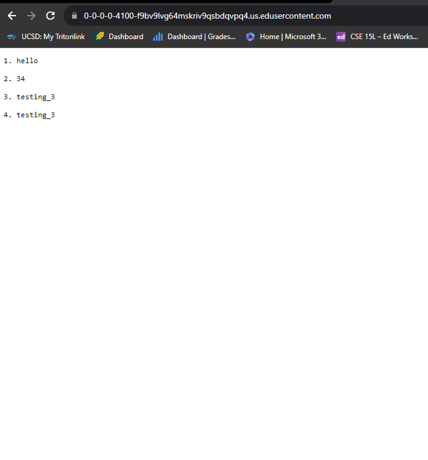

**LabReport-2 Material**  
  
**Code**
  
**Screnshot Number 1**
I utilized formatting methods in order to get both a number, and the string "hello" into a single array for my list.  
The relevant values for the strings were the inputted text, as well as the distinct position at which an item in the list was located. Through this way I was able to distinguish variables and make a numbered list.  
No values were directly changed, except there was the usage of a new .txt document that held the data momentarily.  
  
**Screenshot Number2**
For the next example I utilized 3 different values in order to make sure the code worked correctly. I did an integer, as well as two duplicate blocks of text.  
The relevant values were of course the position in the list, and what it contains. I did two duplicates to make sure that the list doesn't merge duplicates and instead gives them a distinct address.  
Again, no values were directly changed except the .txt document which was empty and momentarily had data before being wiped again.  
  
  
  
**What I learned in W2/3**
I did not know how accessible and easy it was to created a remote key for signing in. I have done this previously but the method that we took in this lab went by a lot faster and overall took half the amount of time that it took me previously. I previously used github for ssh keys, so this is overall new to me.
