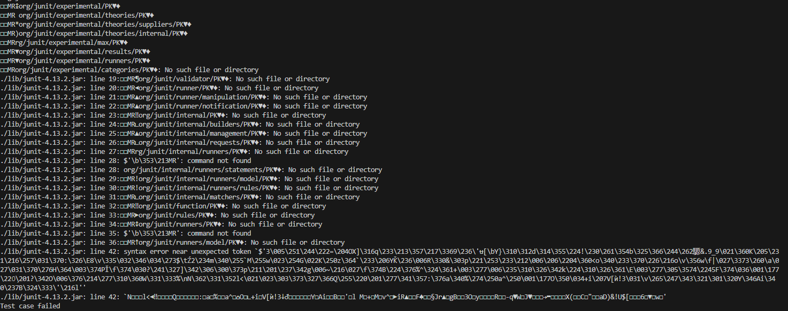
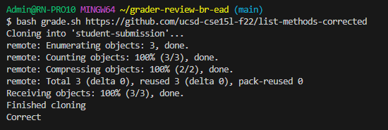

# 1:
#### Student:  
Hello, I recently typed up my grade.sh, but I am starting to receive issues for no real reason. It worked previously when I was in lab doing it with another TA, and I do not know why it is not working now. 
I think it may be something to do with my JUnit test, as there are a ton of errors regarding it, but that wouldn't make sense since I properly pathed to them when I was at the lab.

# 2:
#### TA:  
Hello, it appears that the JUnit test are never initialized. This may come as a result of the importing process. Some things that matter are if you are 
utilizing bash or powershell? Did you switch from mac to windows and not adjust the : for macs or ; for windows?  
# 3:
#### Student:  
Hello, I took your suggestion andd I realized that while this code would have worked on my macbook in class, but it would not ever work on my windows desktop at home. I did not switch the ':' into ';' and that lead me to these importation errors.
  

# 4:
#### File/Directory Structure
<pre>
/home  
  -/GradeServer.java  
  -/Handler.java  
  -/Server.java  
  -/TestListExamples.java  
  -/student-submission  
    -/nullptr
  -/grading-area  
    -/nullptr
  -/lib  
    -/hamcrest-core-1.3.jar  
    -/junit-4.13.2.jar  
  -/grade.sh
</pre>
#### File contents  
What I needed was a server for my general server. The contents of Server.java basically served to setup a handler, and created an internal server.There was also a grade server for the processes that needed to occur. Since I was importing repositories from outside of my desktop, I needed to host a server such that my programs could access them. This access was done with another file called ServerHttpHandler which was utilized by my server. This was all done in my /home.  
I then had a file called Grade.sh where I kept all of my command lines. This is also where I had my issue regarding the : and
;. In this file, it basically ran a ton of shell commands that ran all of the files in the home directory in a selected new directory called grading-area. The code is in my /home, and the grading-area was a directory created in my /home as well. The shell commands first deleted previous instances of student-submissions and grading area. It then cloaned the submission into a new instance of student-submission. Afterwards, it copied the imported file as well as the test file into the grading-area, before entering into it. It was then that both the JUnit test were access from an outside directory, and then run. (my issue ended up being regarding the access of the JUnit test, however).
#### What I needed to do to get to the bug
bash grade.sh https://github.com/ucsd-cse15l-f22/list-methods-corrected

#### Edits needed  
I needed to first make the transition from mac to windows. Albeit, it is a simple bug this has made me ponder at my desks for hours so writing this scenario is very realistic to me.  

# 5
#### Things I learned
I did not know how to use vim so well originally, in all honestly I thought it didn't make sense and there was a ton of issues I had corresponding with it. After I utilized the entire tutorial, however, I started to get the hang of it and I didn't have much trouble editing documents within the terminal anymore. Utilizing the git functions is also quite fascinating, because I struggled with it before to go from local to server and this class taught a lot about it to me.

