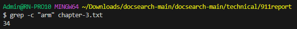
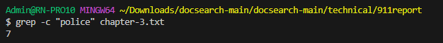
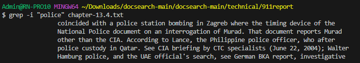
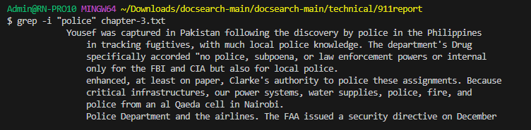
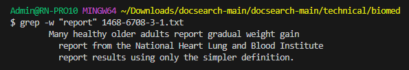
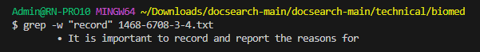
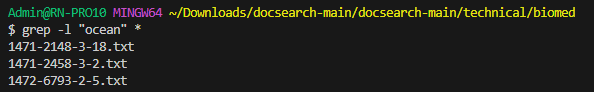
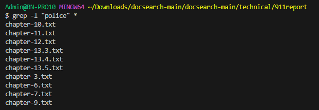

#### Before  
  ```
  static int[] reversed(int[] arr) {    
    int[] newArray = new int[arr.length];    
    for(int i = 0; i < arr.length; i += 1) {    
      arr[i] = newArray[arr.length - i - 1];    
    }    
    return arr;    
  }  
```
#### After  
```
  static int[] reversed(int[] arr) {
    int[] newArray = new int[arr.length];
    for(int i = 0; i < arr.length; i += 1) {
      newArray[i] = arr[arr.length - i - 1];
    }
    return newArray;
  }
```
#### Issues with the code
In the before code, the wrong value is being called for the array. It should be calling the newArray instead. There is also an issue with calling newArray[arr.length - i -1]. By calling this you are essentially only making arr[i] equal to 0. You ae basically returning an array of only 0. I made some adjustments, and returned the newArray and adjusting it to properly get the reversal.  
#### Will induce a failure with the Before code.  
```
java -cp ".;lib/junit-4.13.2.jar;lib/hamcrest-core-1.3.jar" org.junit.runner.JUnitCore ArrayTests
```
```
  @Test
  public void testReversed() {
    int[] input1 = {1, 2, 3 };
    assertArrayEquals(new int[]{ 3, 2, 1 }, ArrayExamples.reversed(input1));
  }
```
  
#### Will not induce a failure with the After Code  
```
  public void testReversed() {
    int[] input1 = {1, 2, 3 };
    assertArrayEquals(new int[]{ 3, 2, 1 }, ArrayExamples.reversed(input1));
  }
```
   

#### Grep commands

# -c
```
grep -c "string" file.txt
```
   
   
This command will circumnavigate a file and return an integer corresponding with the number of times that string/pattern is visible in the file. Can be useful and is similar to ctrl-f  
Information taken from https://www.geeksforgeeks.org/grep-command-in-unixlinux/#  

# -i
```
grep -i "string" file.txt
```
   
   
This command will navigate a file and return all times that the string is present and disregards casing. It will return the entire sentence in which the string was found. Would help if you need to find out all times a solo string is in a text.  
Information taken from https://www.geeksforgeeks.org/grep-command-in-unixlinux/#  

# -w

```
grep -w "string" file.txt
```
   
   
This command will navigate through a file, and unlike -i, it will care about casing. It will return the entire string that the searched for string is apart of. If for example, our word is blank and we have blank.txt , it will return blank.txt alongside the remaining sentence. Can be useful for finding out the number of times a string is present even when hidden in other strings.  
Information taken from https://www.geeksforgeeks.org/grep-command-in-unixlinux/#  

# -l
```
grep -l "string" *
```
   
   
This command will navigate the entire directory and return all files in which the selected string is inside it. If for example, the current directory contains the files 1.txt and 2.txt, and the code is grep-l "hello" it will return 1.txt and/or 2.txt depending on if hello is within the two files. It can be useful for scanning entire chapters instead of just pages.  
Information taken from https://www.geeksforgeeks.org/grep-command-in-unixlinux/#  
