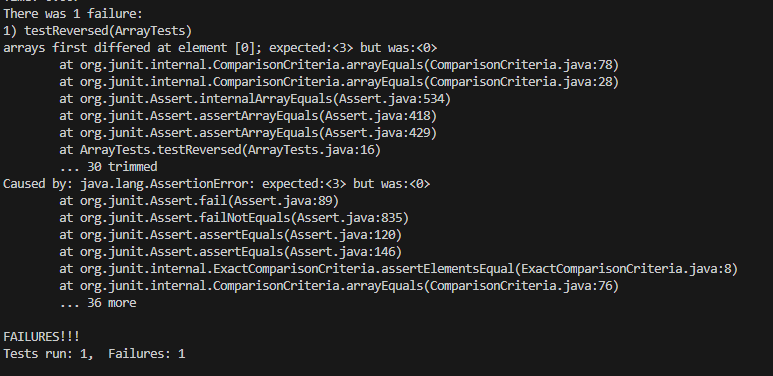
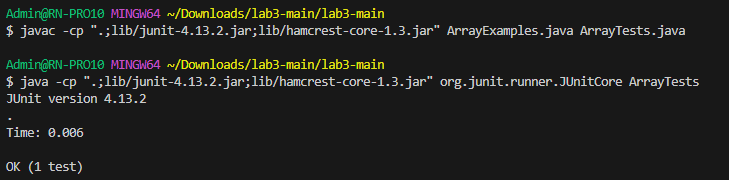

Before  
  ```
  static int[] reversed(int[] arr) {    
    int[] newArray = new int[arr.length];    
    for(int i = 0; i < arr.length; i += 1) {    
      arr[i] = newArray[arr.length - i - 1];    
    }    
    return arr;    
  }  
```
After  
```
  static int[] reversed(int[] arr) {
    int[] newArray = new int[arr.length];
    for(int i = 0; i < arr.length; i += 1) {
      newArray[i] = arr[arr.length - i - 1];
    }
    return newArray;
  }
```
In the before code, the wrong value is being called for the array. It should be calling the newArray instead. There is also an issue with calling newArray[arr.length - i -1]. By calling this you are essentially only making arr[i] equal to 0. You ae basically returning an array of only 0. I made some adjustments, and returned the newArray and adjusting it to properly get the reversal.  
Will induce a failure with the Before code.  
```
java -cp ".;lib/junit-4.13.2.jar;lib/hamcrest-core-1.3.jar" org.junit.runner.JUnitCore ArrayTests
```
```
  @Test
  public void testReversed() {
    int[] input1 = {1, 2, 3 };
    assertArrayEquals(new int[]{ 3, 2, 1 }, ArrayExamples.reversed(input1));
  }
```
  
Will not induce a failure with the After Code  
```
  public void testReversed() {
    int[] input1 = {1, 2, 3 };
    assertArrayEquals(new int[]{ 3, 2, 1 }, ArrayExamples.reversed(input1));
  }
```
 
