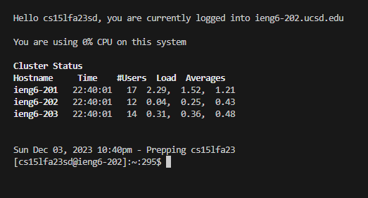
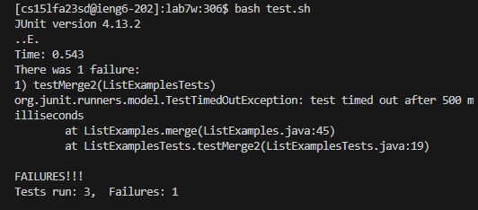
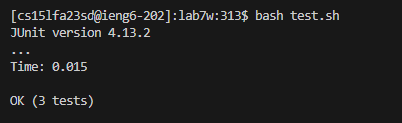
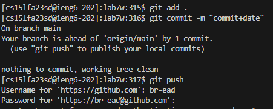

### 4
The first step is to login. Because I set up my ssh earlier, all I have to do is write in terminal  
```
ssh cs15lfa23sd@ieng6.ucsd.edu
```
Followed by a ```<enter>```.  
  
### 5
Go to the github link. https://github.com/ucsd-cse15l-s23/lab7  
Click on "Fork" and clone it to a repository.  
Click on "< > Code"  
Click on ssh and copy the text that begins with git@github.com -- Should look like git@github.com:ucsd-cse15l-s23/lab7w.git  
Write out in terminal, git clone and paste. Should be like this  
```
git clone git@github.com:ucsd-cse15l-s23/lab7w.git
```
Followed by a ```<enter>```  

### 6
It should now clone into your repository.  
You should now go into that directory, so in your terminal write  
```
cd lab7w
```
```<enter>```  
You are now in lab7w directory.  
Now you should run the test. Do this using  
        
```
bash test.sh
```
```<enter>```  
Your expected output should be a failure.  

```
        
JUnit version 4.13.2
..E
Time: 0.671
There was 1 failure:
1) testMerge2(ListExamplesTests)
org.junit.runners.model.TestTimedOutException: test timed out after 500 milliseconds
        at java.base/java.util.Arrays.copyOf(Arrays.java:3512)
        at java.base/java.util.Arrays.copyOf(Arrays.java:3481)
        at java.base/java.util.ArrayList.grow(ArrayList.java:237)
        at java.base/java.util.ArrayList.grow(ArrayList.java:244)
        at java.base/java.util.ArrayList.add(ArrayList.java:454)
        at java.base/java.util.ArrayList.add(ArrayList.java:467)
        at ListExamples.merge(ListExamples.java:42)
        at ListExamplesTests.testMerge2(ListExamplesTests.java:19)

FAILURES!!!
Tests run: 2,  Failures: 1
```
### 7
You will now need to adjust the ListExamples.java to make sure the code runs accordingly. You can do it in vim.  
First go to ListExamples.java, the source of the bug, in your terminal using ->  
```
vim ListExamples.java
```
To navigate using vim, 'h' is left one character, 'l' is right one character, 'k' is up one line, and 'j' is down one line. Typing 'x' will delete a character, and typing 'i' will insert a character. We will then use :wq to 
save and quit.  

The error we get is because index1 should be index2 so we navigate to the line 45 where index1 is at. We will then navigate to the character '1' of index1, delete it using x, inserting in '2' using i, and 
then save and quit using :wq.  
``` j ``` 44 times  
``` l ``` 11 times  
``` x ``` 1 time  
``` i ``` 1 time  
Type '2'  
```<esc>```  
```:wq```  
```<enter>```  
### 8 
We can now run the code again, to which we should reach a full completion of the test cases.  
This can be done using
```
bash test.sh
```
```<enter>```  
We will then come to the solution of  
  
```
[cs15lfa23sd@ieng6-201]:lab7w:267$ bash test.sh
JUnit version 4.13.2
...
Time: 0.147

OK (3 tests)

[cs15lfa23sd@ieng6-201]:lab7w:268$
```
### 9
The last step is to commit this to our repository. Thus, we want to send this to our repository now. We can do this using.
```
git add .
```
``` <enter> ```
This will add everything edited within the directory to the staging area.  
We will then establish our commit with the date of the commit to finish it up.
```
git commit -m "commit+date" 
```
``` <enter> ```
It is then that we can push to github. This can be done using 
```
git push 
```
``` <enter> ```  
You then type in your information and password, I will not be showing you that.  
```text.... <enter> ```  
``` text... <enter> ```  


