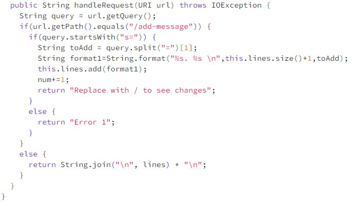
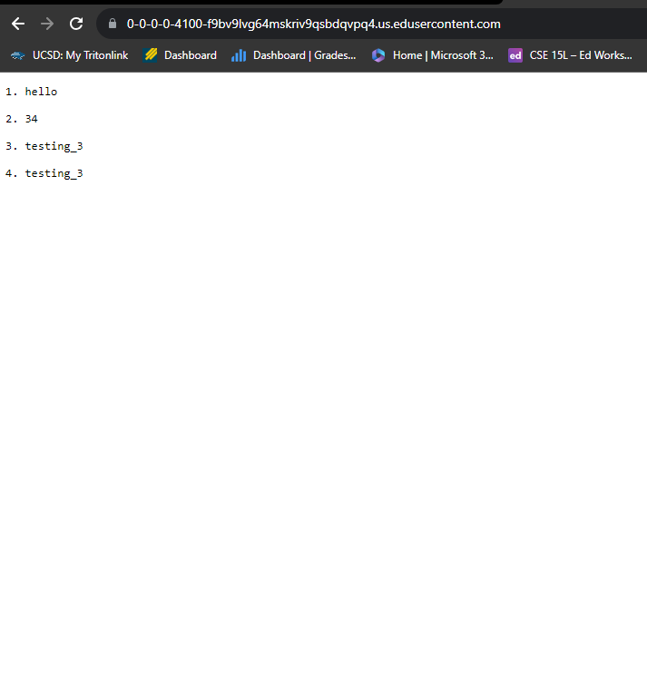
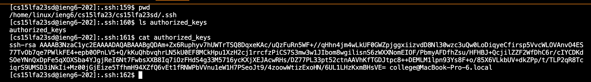
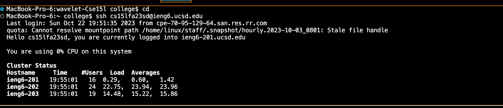

**LabReport-2 Material**  
  
**Code**  
  
**Screnshot Number 1**  
I utilized formatting methods in order to get both a number, and the string "hello" into a single array for my list. The handleRequest method was utilized with the argument https://0-0-0-0-4000-mv6p1skiufs90p3jj2ag13e3no.us.edusercontent.com/add-message?s=hello.

The relevant values for the strings were the inputted text, as well as the distinct position at which an item in the list was located. Through this way I was able to distinguish variables and make a numbered list.  

There are no changes that occured to the method after I input a new string into the variable with add-message?s='string'. If I added a new string, the request would process and be read again to add a completely new variable, with its string and corresponding number. This can be seen if no output "" was input into https://0-0-0-0-4000-mv6p1skiufs90p3jj2ag13e3no.us.edusercontent.com.  

  
**Screenshot Number2**  
Alike the first one, the handleRequest method was utilized. The argument used was an integer, as well as two duplicate blocks of text. The argument was the https://0-0-0-0-4000-mv6p1skiufs90p3jj2ag13e3no.us.edusercontent.com/add-message?s=34, https://0-0-0-0-4000-mv6p1skiufs90p3jj2ag13e3no.us.edusercontent.com/add-message?s=34 and https://0-0-0-0-4000-mv6p1skiufs90p3jj2ag13e3no.us.edusercontent.com/add-message?s=testing_3  

The relevant values were of course the position in the list, and what it contains. I did two duplicates to make sure that the list doesn't merge duplicates and instead gives them a distinct address.  

The values input changed with every entry of https://0-0-0-0-4000-mv6p1skiufs90p3jj2ag13e3no.us.edusercontent.com/add-message?s='string'. It would, however, not change the method and instead it would simply read it if there were an input. The request would be processed and add a string alongside with a number in front of it corresponding to what position in the queue it is, and add that corresponding string. This worked for all values, including integers.  
# Public and Private Key
  
  
  

**What I learned in W2/3**  
I did not know how accessible and easy it was to created a remote key for signing in. I have done this previously but the method that we took in this lab went by a lot faster and overall took half the amount of time that it took me previously. I previously used github for ssh keys, so this is overall new to me.
